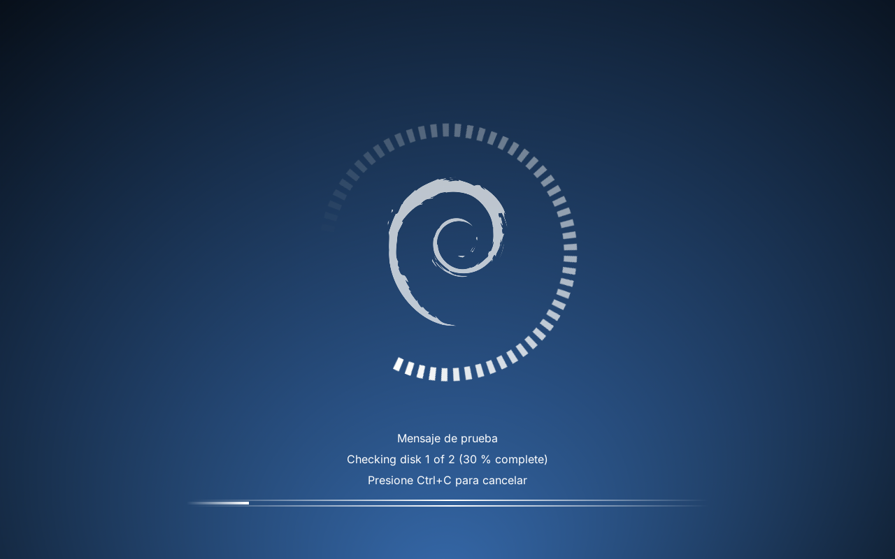
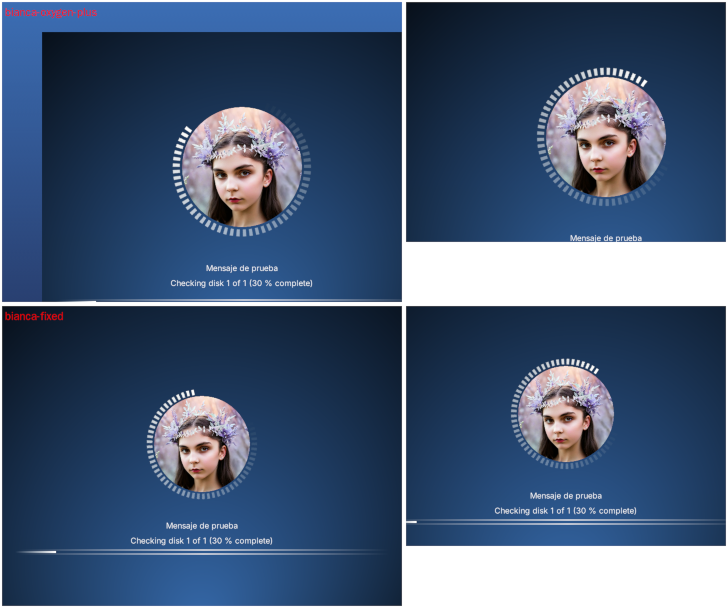

# Bianca Oxigeno Plus — tema para Plymouth

[ES] Tema de arranque Plymouth con el logo de Debian, anillo giratorio y barra de progreso. Soporta varios monitores, chequeos fsck y pedido de contraseña.

[EN] Plymouth boot splash theme with the Debian logo, spinning ring and progress bar. Supports multiple monitors, fsck checks and password prompts.



## Novedades respecto de bianca-oxygen

- **Soporte multi-monitor:** el fondo cubre todos los monitores y el logo, los textos y la barra quedan centrados en cada uno, aunque tengan resoluciones distintas.
- **Mensajes de fsck corregidos:** la cola de chequeos se vacía correctamente y los mensajes de `systemd-fsckd` quedan visibles.
- **Diálogo de contraseña:** el anillo giratorio vuelve a aparecer después de ingresar la contraseña.
- **Script más liviano:** se eliminó código sin uso y se reutilizan los sprites, lo que reduce el trabajo en cada actualización.

### El problema multi-monitor

Con varios monitores, Plymouth dibuja todo en un lienzo común del tamaño del monitor más grande, y cada monitor muestra una zona centrada de ese lienzo. Sin índice, `Window.GetWidth()` y `Window.GetHeight()` devuelven el tamaño del monitor **más grande**, mientras que `Window.GetX()` y `Window.GetY()` devuelven el desplazamiento del **más chico**. Al combinar esos valores, el logo y el fondo quedaban corridos hacia abajo y a la derecha.

La solución:

- el fondo se ancla en `(0,0)` y cubre el lienzo completo;
- el logo, el anillo, los textos y la barra se ubican en la zona que ven todos los monitores (la del más chico).

Antes y después, con dos monitores de distinta resolución:



## Requisitos

- Plymouth con el plugin `script` (incluido en el paquete `plymouth` de Debian, Ubuntu y derivadas).
- `plymouth-label` (o `plymouth-themes`) para mostrar los textos.

## Instalación

```bash
git clone https://github.com/GustaVito71/plymouth-theme-bianca-oxigeno-plus.git
cd plymouth-theme-bianca-oxigeno-plus
sudo ./install.sh
```

El instalador copia solo los archivos del tema a `/usr/share/plymouth/themes/bianca-oxigeno-plus/`, lo selecciona como tema activo y regenera el initramfs.

## Volver al tema anterior

```bash
sudo plymouth-set-default-theme -R <tema-anterior>
# o editá Theme= en /etc/plymouth/plymouthd.conf y ejecutá: sudo update-initramfs -u
```

## Créditos y licencia

- Tema original **MIB Ossigeno Ultimate Plymouth** de [Emanuele](https://www.gnome-look.org/u/emanueleeeee).
- La lógica de fsck deriva del tema `ubuntu-logo` de Plymouth.
- Adaptación y mejoras: Gustavo Pérez Reyes.
- Logo: *Debian Open Use Logo*, Copyright © 1999 Software in the Public Interest, Inc., bajo LGPL v3 o posterior o CC BY-SA 3.0 (a elección). Tomado del paquete `desktop-base`. Debian es una marca registrada de Software in the Public Interest, Inc.; este tema no es un proyecto oficial de Debian.

El código y las imágenes propias se distribuyen bajo la licencia **GNU GPL v3 o posterior** (ver [LICENSE](LICENSE)); el logo de Debian conserva su propia licencia.
